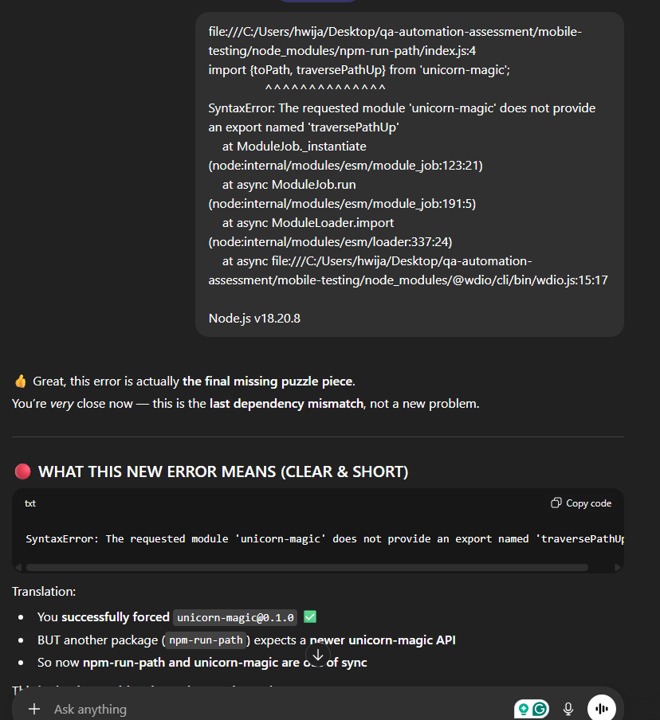
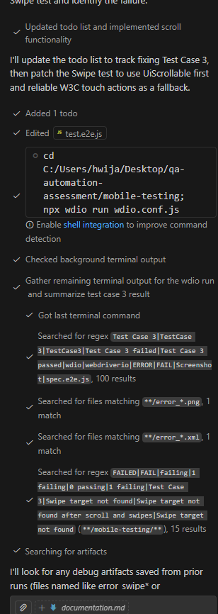
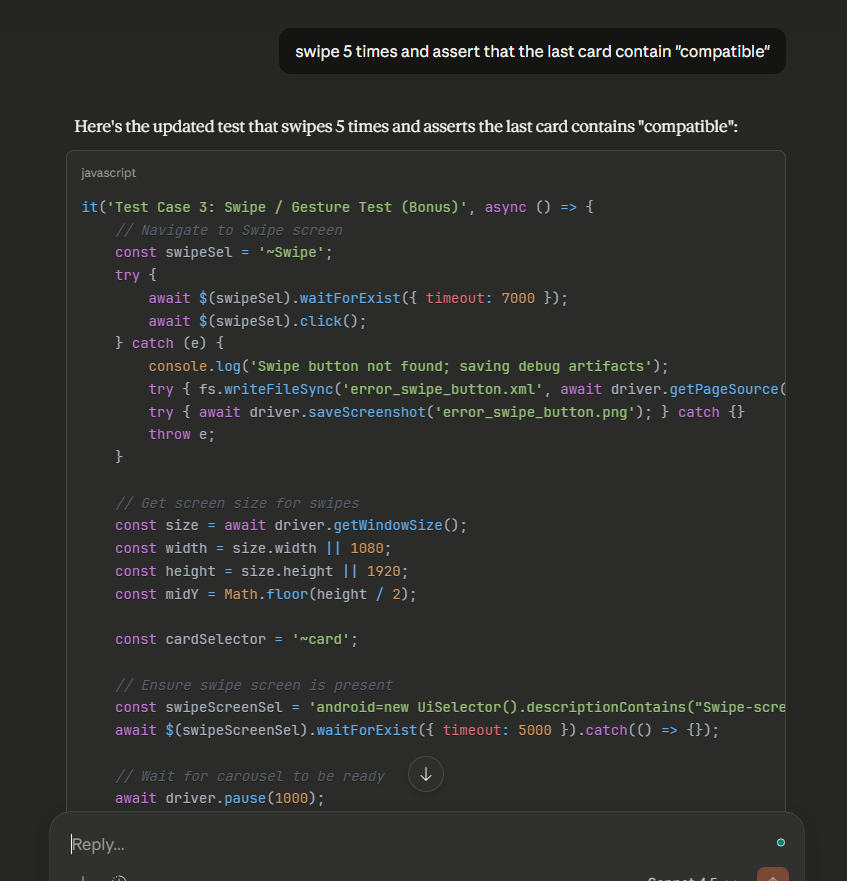

# WebdriverIO Native Demo App – Test Documentation

## 1. Overview

This document describes the setup, design decisions, locator strategy, AI usage, test cases, and observed results for automated testing of the **WebdriverIO Native Demo App** using **WebdriverIO + Appium** on Android.

The test suite validates three main user flows:

1. Login flow (positive & negative handling)
2. Forms interaction flow
3. Swipe / gesture flow (carousel)

---

## 2. Setup Steps Followed

### 2.1 Prerequisites

* Node.js (LTS)
* Java JDK (required by Appium / Android tooling)
* Android-NativeDemoApp.apk
* Android Studio

### 2.2 Environment Variables

Ensure the following variables are set:

```bash
ANDROID_HOME=/path/to/Android/Sdk
ANDROID_SDK_ROOT=/path/to/Android/Sdk
JAVA_HOME=/path/to/jdk
```

### 2.3 Installed Dependencies

```bash
npm init -y
```
```bash
npm install webdriverio @wdio/cli @wdio/mocha-framework appium fs
```
```bash
npm install -g appium
```
```bash
appium driver install uiautomator2
```
```bash
npm install @wdio/cli
```

### 2.4 Running the Test

```bash
Open the virtual device from Android Studio - Pixel 5
```
```bash
appium
```
```bash
npx wdio run wdio.conf.js
```

---

## 3. Element Locator Strategy

Multiple locator strategies are intentionally combined to increase test stability.

### 3.1 Accessibility ID (Primary)

Used wherever possible due to speed and reliability.

```js
$('~Login')
$('~input-email')
$('~button-LOGIN')
```

### 3.2 Android UiSelector (Fallback)

Used for text-based validation and dynamic UI elements.

```js
android=new UiSelector().textContains("You are logged in!")
android=new UiSelector().textMatches("(?i).*compatible.*")
```

### 3.4 Multi‑Selector Recovery Strategy

For unstable dialogs (e.g. OK button), the test tries **multiple selectors sequentially** to reduce flakiness.

---

## 4. AI Tools Utilized

AI was used to:

* Create template test structure
* Design robust login validation logic (success OR error)
* Improve wait strategies using `waitUntil`
* Suggest fallback selectors for unstable UI elements
* Improve swipe gesture reliability

### 4.1 ChatGPT (Test Design)

<p align="center">
  <br>

  <br>
 This example shows how I use ChatGPT to help with installation.
 <br><br>
</p>

### 4.2 Github Copilot (Debugging Test Script)

<p align="center">
  <br>

  <br>
 This example shows how I use Github Copilot chat to help with debugging.
 <br><br>
</p>

### 4.3 Claude (Vibe Code)

<p align="center">
  <br>

  <br>
 This example shows how I use Claude to help with coding.
 <br><br>
</p>

### 4.4 Benefits of AI Usage

* Help with installation
* Help with test structure
* Faster root‑cause analysis
* Production‑style defensive automation patterns

---

## 5. Test Cases

### 5.1 Test Case 1 – Login Flow

**Steps:**

* Navigate to Login screen
* Enter email and password
* Tap Login
* Validate either success or error result

**Validation:**

* Success dialog: `You are logged in!`
* Error message: `Invalid credentials`

**Result Handling:**

* Attempts to click OK using multiple selectors
* Saves debug artifacts if dialog is not found

---

### 5.2 Test Case 2 – Forms Test

**Steps:**

* Navigate to Forms screen
* Fill text input
* Toggle switch
* Select dropdown option

**Validation:**

* Text input value is verified
* Switch state change is logged

---

### 5.3 Test Case 3 – Swipe / Gesture Test

**Steps:**

* Navigate to Swipe screen
* Detect carousel cards
* Perform 5 swipe gestures
* Search for text containing "compatible"

**Advanced Validation:**
Three detection strategies are used:

1. Iterating all TextViews
2. UiSelector textContains
3. Case‑insensitive regex match

---

## 6. Test Results & Observations

### 6.1 Stability

* Accessibility IDs provided highest reliability
* Fallback selectors significantly reduced flaky failures

### 6.2 Performance

* Explicit waits outperform static pauses
* Swipe gestures require small delays for UI updates

### 6.3 Debugging Efficiency

* Automatic screenshots + XML dumps greatly improved failure analysis
* Page source inspection revealed cases where text existed but was not visible

---

## 6. Conclusion

This test suite demonstrates production‑ready mobile automation practices:

* Defensive coding
* Multi‑locator strategies
* AI‑assisted design
* Robust failure diagnostics

The approach is scalable, maintainable, and suitable for CI pipelines.

---


